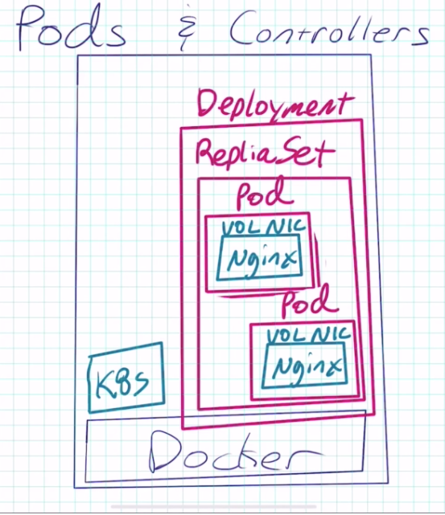
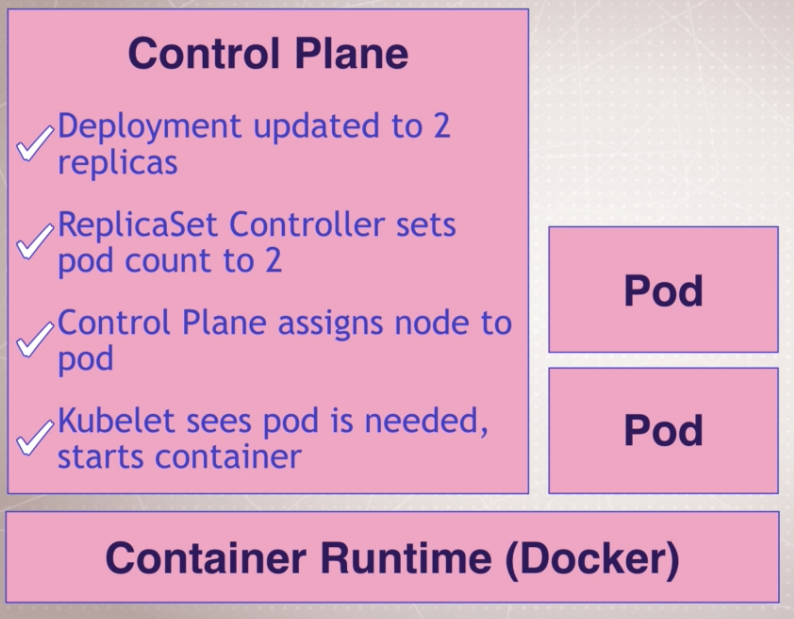

#### Cheat sheet(s) ####
https://kubernetes.io/docs/reference/kubectl/cheatsheet/
https://kubernetes.io/docs/reference/kubectl/docker-cli-to-kubectl/

#### Basic diagrams



#### get the version ####
```kubectl version```
* provides the server version and the cli version  

#### Create a deployment
```
kubectl run my-nginx --image nginx
kubectl get pods
kubectl get all
kubectl delete deployment my-nginx
```

* This creates a POD, a REPLICASET and a DEPLOYMENT
* DEPLOYMENT - encompasses almost all aspects of the POD (container, image, nic, volume, replica set)
* REPLICASET - is to ensure the number of containers running is correct  
* RUN is set to be deprecated

#### Scaling a deployment
```
kubectl run my-apache --image httpd
kubectl scale deploy/my-apache --replicas 2
```

#### viewing logs for deployments
```
kubectl logs deployment/my-apache
kubectl logs deployment/my-apache --follow --tail 1
kubectl logs -l run=my-apache
```

#### Describe the PODS you have
```
kubectl get pods
kubectl describe ${pod/uniquename}
```

#### Delete a POD and see the DEPLOYMENT recreate the POD automatically
```
kubectl get pods -w
kubectl delete ${pod/uniquename}
```  
* Running the pod deletion command will cause the POD to be re-created. This is due to the fact that it was deployed as a DEPLOYMENT not a pod. To delete it properly you delete the DEPLOYMENT.  

```
kubectl get all
kubectl delete deployment/my-apache
```

#### Breaking down run
```kubectl run --generator=run-pod/v1 tmp-shell --rm -it --image=bretfisher/netshoot -- bash```  
  
* run a container
* --generator is the type of template
* tmp-shell is the POD name
* --rm remove resources after build
* -it interactive and give it a tty
* --image set the image
*`` -- bash`` (means ignore the images dflt RUN command and override with command specificied)

#### Future of kubectl RUN  
* Right now ```kubectl RUN``` creates a deployment. Soon it will only create a POD. The expectation is that all commands should move to ```kubectl CREATE```.

#### Assuming a session on a container
```
kubectl run --generator=run-pod/v1 tmp-shell -it --image=bretfisher/netshoot -- bash
kubectl attach tmp-shell -c tmp-shell -i -t
kubectl delete pod tmp-shell
```
* -c is the container name

#### Name Spaces
```kubectl get namespaces```

#### Get services by their assigned label
```kubectl get service -l app=nginx-1```