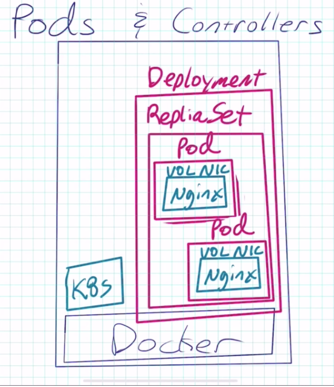
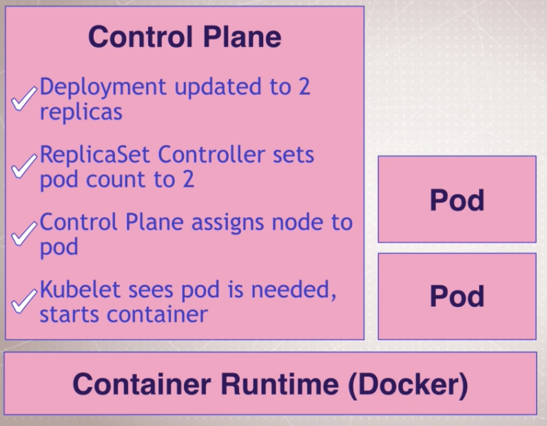

#### Cheat sheet(s) ####
https://kubernetes.io/docs/reference/kubectl/cheatsheet/
https://kubernetes.io/docs/reference/kubectl/docker-cli-to-kubectl/

#### kubectl run

kubectl version
provides the server version and the cli version

#### Create a deployment
```kubectl run my-nginx --image nginx```
* This creates a POD, a REPLICASET and a DEPLOYMENT
* DEPLOYMENT - encompasses almost all aspects of the POD (container, image, nic, volume, replica set)
* REPLICASET - is to ensure the number of containers running is correct  

```
kubectl get pods
kubectl get all
kubectl delete deployment my-nginx
```

#### Scaling a deployment
```
kubectl run my-apache --image httpd
kubectl scale deploy/my-apache --replicas 2
```




#### Inspecting a replica
#### logs
```
kubectl logs deployment/my-apache
kubectl logs deployment/my-apache --follow --tail 1
kubectl logs -l run=my-apache
```
#### Describe the PODS you have
```
kubectl get pods
kubectl describe pod/my-apache-6b4dc47d85-85n7m
```

#### Delete a POD and see the DEPLOYMENT recreate the POD automatically
```
kubectl get pods -w
kubectl delete pod/my-apache-6b4dc47d85-85n7m
```  

* Running the pod deletion command will cause the POD to be re-created. This is due to the fact that it was deployed as a DEPLOYMENT not a pod. To delete it properly you delete the DEPLOYMENT.  

```
kubectl get all
kubectl delete deployment/my-apache
```
